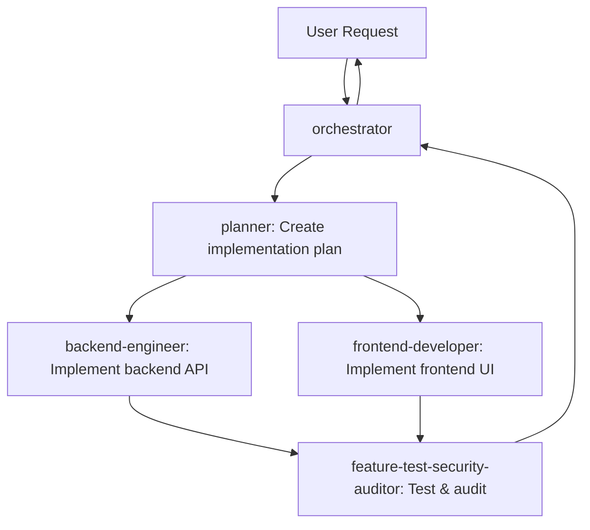

# AGENTS.md

This repository contains a **Orbital AI application** with:
- **Backend**: FastAPI (FastAPI template with PostgreSQL, Redis, Kafka) - in `/fastapi`
- **Frontend**: Vue 3 + Vite + JavaScript (to be created in `/vue`)
- **Inference**: Ollama service (to be added via Docker Compose)

---

## Quick Commands

### Backend (FastAPI) - `/fastapi`
```bash
cd fastapi

# Install deps
poetry install

# Run dev server (port 8000)
poetry run uvicorn app.asgi:application --reload --host 0.0.0.0 --port 8000

# Run tests
FASTAPI_CONFIG=testing poetry run pytest -v

# Run with Docker
docker-compose up -d

# Run migrations
poetry run alembic upgrade head

# Create migration
poetry run alembic revision --autogenerate -m "msg"

# Lint
poetry run flake8 .
```

### Frontend (Vue 3 + Vite) - `/vue` *(not yet created)*
```bash
cd vue

# Create project (run once) — JavaScript template, NOT TypeScript
npm create vite@latest . -- --template vue

# Install deps
npm install

# Dev server (port 5173)
npm run dev

# Build
npm run build

# Lint
npm run lint
```

### Full Stack (Docker Compose) - from root
```bash
# From repo root - will need docker-compose.yaml with all 3 services
docker-compose up -d
```

---

## Backend Structure (`/fastapi`)

```
app/
├── asgi.py              # ASGI entry point
├── controllers/         # Controllers (MVC)
├── core/                # Core config, exceptions
├── providers/           # Providers (Redis, etc)
├── schema/              # Pydantic schemas
├── services/            # Business logic (Keycloak, Redis)
├── tasks/               # Celery tasks
└── utils/               # Utils (auth, responses)
```

**Key files:**
- `config.py` / `.env` - Configuration (loads via `pydantic-settings`)
- `alembic.ini` / `migrations/` - DB migrations (PostgreSQL)
- `celery_app.py` / `celeryconfig.py` - Celery + Redis
- `pyproject.toml` - Poetry dependencies (FastAPI 0.119, Python 3.12+)
- `pytest.ini` - Test config (set `FASTAPI_CONFIG=testing`)

---

## Planned Architecture (Not Yet Implemented)

```
qwen-chat/
├── fastapi/          # ✅ Existing FastAPI backend
├── vue/              # 🚧 Vue 3 + Vite frontend (to create)
├── docker-compose.yaml  # 🚧 Root compose with: fastapi, vue, ollama, postgres, redis
└── ollama/           # 🚧 Ollama service (Docker) for Qwen inference
```

**Planned services in root `docker-compose.yaml`:**
| Service | Port | Purpose |
|---------|------|---------|
| fastapi | 8000 | Backend API |
| vue | 5173/80 | Frontend (Vite dev / Nginx prod) |
| ollama | 11434 | Qwen inference |
| postgres | 5432 | Database |
| redis | 6379 | Cache/Celery broker |

**Ollama model:** `qwen2.5:7b` (or similar)

---

## Key Conventions

### Backend (FastAPI)
- **Python 3.12+**, Poetry for deps
- **MVC pattern**: `controllers/` → `services/` → `repositories/`
- **Dependency injection**: `pinject`
- **Async**: Use `async/await` with `asyncpg`/`httpx`
- **Migrations**: Alembic (run `alembic upgrade head` before dev)
- **Tests**: `pytest` with `FASTAPI_CONFIG=testing`
- **Lint**: `flake8` (config in `.flake8`)

### Frontend (Vue 3) - Planned
- **Vue 3 + Vite + JavaScript** — **NO TYPESCRIPT** (explicit user requirement)
- Use `<script setup>` without `lang="ts"`
- **Pinia** for state management
- **Axios** for API calls to FastAPI
- **WebSocket** for streaming chat responses from Ollama via FastAPI proxy
- **Vite config**: `js` not `ts`, no `vue-tsc` in build

### Environment Variables
- **Backend**: `/fastapi/.env` (see `.env.example`)
- **Frontend**: `/vue/.env` (Vite uses `VITE_` prefix)
- **Ollama**: `OLLAMA_HOST=http://ollama:11434` in docker-compose

---

## Common Tasks

### Add new API endpoint (Backend)
1. Create schema in `app/schema/`
2. Create service in `app/services/`
3. Create controller in `app/controllers/v1/`
4. Register route in `app/controllers/v1/__init__.py`

### Run single test
```bash
cd fastapi
FASTAPI_CONFIG=testing poetry run pytest tests/views/test_sync_resource_view.py -v
```

### Add Ollama integration (planned)
1. Add `ollama` Python package to `pyproject.toml`
2. Create `app/services/ollama_service.py` for chat completions
3. Add WebSocket endpoint in FastAPI for streaming
4. Add Ollama service to root `docker-compose.yaml`

---

## Gotchas

- **Poetry venv**: Run commands with `poetry run` or activate via `poetry shell`
- **Env config**: Set `APP_ENV=development|testing|production` (default: development)
- **DB migrations**: Run `alembic upgrade head` after pulling changes
- **Celery**: Run worker with `poetry run celery -A app.celery_app worker -l info`
- **Frontend not created yet**: Run `npm create vite@latest vue -- --template vue` from root
- **Ollama not in docker-compose yet**: Add service with `ollama/ollama` image and model pull

---

## Project Structure Notes

- **Root AGENTS.md** (this file) is the single source of truth for the qwen-chat project
- **`.opencode/`** folder contains OpenCode configuration only (skills, agents, plugins)
- The `.opencode/AGENTS.md` was removed — it was for a different project (vue-skills development)

---

## Parallel Implementation Workflow

For full-stack features where both frontend and backend are well-defined, use this delegation pattern for parallel execution:

1. **implementation-planner** — Analyze requirements and create detailed implementation plan
2. **backend-engineer** — Implement backend API, database, business logic, auth
3. **feature-test-security-auditor** — Run feature tests and security audit on backend
4. **frontend-developer** — Implement Vue 3 frontend (components, stores, API integration)

**Agents run in parallel where possible** (e.g., steps 2 and 4 can overlap after step 1 completes). Do not perform implementation work yourself when a specialist agent exists — delegate to the appropriate agent.

---

## OpenCode Agents

This project uses specialized OpenCode agents for parallel development workflows. Agents are defined in `.opencode/agents/` and configured in `opencode.json`.

### Agent Registry

| Agent | Mode | Purpose |
|-------|------|---------|
| **orchestrator** | primary | Primary orchestrator - coordinates all work, delegates to specialists |
| **planner** | subagent | Creates detailed implementation plans from requirements |
| **backend-engineer** | subagent | Implements FastAPI backend (MVC, pinject DI, async, Alembic, pytest) |
| **frontend-developer** | subagent | Implements Vue 3 + Vite + JavaScript frontend (NO TypeScript), Pinia, Axios, WebSocket |
| **feature-test-security-auditor** | subagent | Runs tests, linting, and security audits (backend + frontend) |

### Agent Workflow



### Delegation Rules
- **Always delegate** - Never implement features yourself when a specialist agent exists
- **Parallel execution** - Run backend-engineer and frontend-developer in parallel after planner completes
- **Sequential testing** - feature-test-security-auditor runs after implementation completes
- **One task per delegation** - Give each agent a clear, single objective

## References
- Backend README: `/fastapi/README.md`
- FastAPI docs: https://fastapi.tiangolo.com
- Vue 3 + Vite: https://vitejs.dev/guide/#scaffolding-your-first-vue-project
- Ollama API: https://github.com/ollama/ollama/blob/main/docs/api.md
- OpenCode Agents docs: https://opencode.ai/docs/agents/